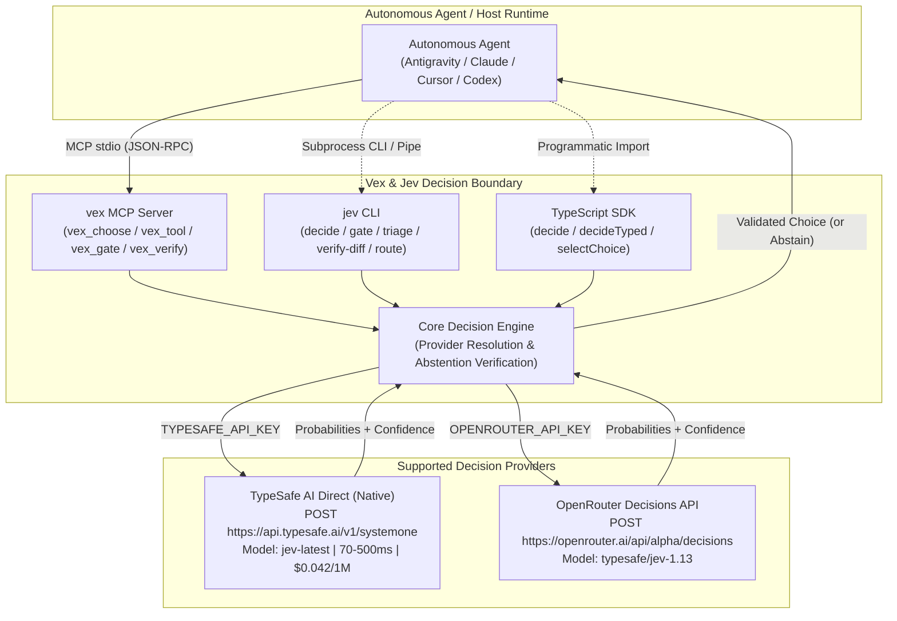

# Vex & Jev

[](https://nodejs.org/)
[](https://www.typescriptlang.org/)
[](https://modelcontextprotocol.io/)
[](https://typesafe.ai/)
[](https://openrouter.ai/)
[](https://vitest.dev/)
[](LICENSE)

> **Bounded decision engine, autonomous agent guardrails, multi-provider CLI, programmatic TypeScript SDK, and Model Context Protocol (MCP) server.**

Autonomous AI coding agents frequently struggle with **confirmation bias**, **tool thrashing**, **circular deliberation**, and **premature completion declarations**. 

**Vex and Jev** provide an independent, external decision boundary. Powered by **TypeSafe AI's System 1 decision model** (both via native **TypeSafe AI Direct** and **OpenRouter Decisions API**), Jev supplies typed, probability-calibrated choices, ordinal risk scores, and safety gates while enforcing strict mathematical abstention thresholds.

---

## ⚡ Highlights

- **External Decision Boundary**: Decouples strategic choices, safety checks, and completion verification from the main generative LLM loop.
- **Dual-Provider Architecture**:
  - 🚀 **TypeSafe AI Direct** (`api.typesafe.ai/v1/systemone`): Ultra-fast (70–500ms), native `jev-latest`, priced at just **$0.042 / 1M input tokens** with unmetered output.
  - 🌐 **OpenRouter Decisions** (`openrouter.ai/api/alpha/decisions`): Multi-model routing and managed balance using `typesafe/jev-1.13`.
- **Strict Bounded Contracts**: Every choice decision evaluates between 2 and 12 distinct options with explicit criteria. No hallucinated options can escape the boundary.
- **Mathematical Abstention Guarantee**: Automatically abstains (`choice: null`, `abstained: true`) if confidence is below `0.70` or the top option's probability lead over the runner-up is below `0.15`.
- **Dual Interface**:
  - **`jev` CLI**: Command-line tool for human operators, shell scripts, and CI/CD piping.
  - **`vex` MCP Server**: High-performance stdio Model Context Protocol server exposing `vex_choose`, `vex_tool`, `vex_gate`, and `vex_verify`.
- **Programmatic TypeScript Library**: First-class SDK exports (`decide`, `decideTyped`, `selectChoice`, `createServer`) for direct integration into agent frameworks.
- **Multi-Runtime Ready**: Out-of-the-box support for Antigravity, Claude Desktop, Cursor, and Codex / Pace.
- **Non-Execution Invariant**: Jev is strictly advisory. It never executes shell commands or alters files; the caller retains execution and verification responsibility.

---

## 🏗️ Architecture Overview



---

## ⚖️ Provider Comparison

| Capability | TypeSafe AI Direct (Recommended) | OpenRouter Decisions API |
|---|---|---|
| **Endpoint** | `https://api.typesafe.ai/v1/systemone` | `https://openrouter.ai/api/alpha/decisions` |
| **Default Model** | `jev-latest` | `typesafe/jev-1.13` |
| **Typical Latency** | ⚡ **70ms – 500ms** | 400ms – 1200ms |
| **Pricing** | 💎 **$0.042 / 1M input tokens** (output tokens free!) | Dynamic OpenRouter pricing |
| **API Key Variable** | `TYPESAFE_API_KEY` (or `JEV_API_KEY`) | `OPENROUTER_API_KEY` |
| **Config File** | `~/.typesafe_key` (or `~/.jev_key`) | `~/.openrouter_key` |
| **Custom Base URL** | `TYPESAFE_BASE_URL` or `JEV_BASE_URL` | `OPENROUTER_BASE_URL` |
| **Custom Model** | `TYPESAFE_MODEL` or `JEV_MODEL` | `OPENROUTER_MODEL` or `JEV_MODEL` |
| **Key Signup** | [console.typesafe.ai](https://console.typesafe.ai) | [openrouter.ai/keys](https://openrouter.ai/keys) |

### Automatic Provider Resolution Hierarchy
1. **Explicit flag / option**: `--provider typesafe` or `options.provider = "typesafe"`.
2. **Environment variable override**: `JEV_PROVIDER=typesafe` or `VEX_PROVIDER=openrouter`.
3. **Auto-detection by key presence**:
   - If `TYPESAFE_API_KEY` (or `~/.typesafe_key`) exists $\rightarrow$ uses **TypeSafe AI Direct**.
   - If `OPENROUTER_API_KEY` (or `~/.openrouter_key`) exists $\rightarrow$ uses **OpenRouter**.
   - If an API key starts with `ts-` $\rightarrow$ auto-routes to **TypeSafe Direct**.
   - If an API key starts with `sk-or-` $\rightarrow$ auto-routes to **OpenRouter**.

---

## 🚀 Quickstart in 60 Seconds

### 1. Installation & Requirements
Requires **Node.js 20+**.

#### Quick Download via npm
```sh
# Install globally
npm install -g @sidearker/vex-mcp

# Or run directly without installation
npx -y @sidearker/vex-mcp
```

#### Or Build from Source
```sh
# Clone repository
git clone https://github.com/SideArker/Vex.git
cd Vex

# Install dependencies and build
npm ci
npm run build
```

### 2. Configure Your API Key
Set either your TypeSafe API key or OpenRouter API key:

```sh
# Option 1: Native TypeSafe AI Direct (Recommended)
export TYPESAFE_API_KEY="ts-live-..."

# Option 2: OpenRouter API Key
export OPENROUTER_API_KEY="sk-or-v1-..."
```

Or store the key securely in your home directory:
```sh
echo "ts-live-..." > ~/.typesafe_key
# or: echo "sk-or-v1-..." > ~/.openrouter_key
```

### 3. Verify Setup with `doctor`
Verify keys and provider connectivity with zero billable API requests:

```sh
node dist/cli/jev.js doctor
# or
node dist/index.js doctor
```

Output:
```text
Jev 0.1.0
Node v22.14.0
Active provider: typesafe
TypeSafe key: available
OpenRouter key: missing
Model: jev-latest
```

### 4. Make Your First Bounded Decision

```sh
node dist/cli/jev.js decide "Which task should take priority?" \
  --option "tests=Fix failing integration tests" \
  --option "feature=Implement user login route" \
  --option "none=Gather reproduction logs first" \
  --context "CI is red on main branch"
```

Output:
```text
Choice: tests (confidence: 0.94)
```

---

## 🤖 MCP Server Setup

Vex provides a high-performance, lean stdio Model Context Protocol (MCP) server exposing **4 specialized tools**:

1. **`vex_choose`**: Evaluates between 2 and 12 supplied options using Kahneman System 1 calibrated probabilities, enforcing the mathematical abstention guarantee.
2. **`vex_tool`**: Dedicated tool selector that picks the leanest tool candidate for a given task, preventing agent speculative thrashing and context bloating.
3. **`vex_gate`**: Pre-action safety check determining if an operation is destructive or requires escalation to human confirmation.
4. **`vex_verify`**: Strict acceptance gate evaluating observed evidence against acceptance criteria before an agent claims completion.

### Host Configurations

#### Claude Desktop (`claude_desktop_config.json`)
```json
{
  "mcpServers": {
    "vex": {
      "command": "node",
      "args": ["/path/to/Vex/dist/index.js", "mcp", "serve"],
      "env": {
        "TYPESAFE_API_KEY": "ts-live-..."
      }
    }
  }
}
```

#### Cursor (`.cursor/mcp.json`)
```json
{
  "mcpServers": {
    "vex": {
      "command": "node",
      "args": ["/path/to/Vex/dist/index.js", "mcp", "serve"],
      "env": {
        "TYPESAFE_API_KEY": "ts-live-..."
      }
    }
  }
}
```

#### Antigravity / Gemini CLI (`mcp/vex`)
Run native Vex tools directly:
```json
{
  "mcpServers": {
    "vex": {
      "command": "node",
      "args": ["C:/Github/Vex/dist/index.js", "mcp", "serve"],
      "env": {
        "TYPESAFE_API_KEY": "ts-live-..."
      }
    }
  }
}
```

---

## 💻 CLI Reference & Scripting

The package provides two executables: `jev` and `vex`.

```text
Usage: jev <command> [options]

Commands:
  decide [file|-]              Choose from supplied options (stdin by default)
  decide "question" --option "id=Description" --option "other=Description"
  run [file|-]                 Execute a typed Decisions JSON request
  workflow <file>              Evaluate workflow choices and review signals
  eval -s <file> -q <file>      Evaluate state and questions files
  route <file> -r <file>       Choose from described routes
  suggest-skill [task]         Choose from supplied skill catalog (-c file)
  triage [task]                Classify an engineering task
  gate [action]                Assess a proposed action
  verify-diff [file|-]         Review a diff
  stats [--raw] [--reset]      Display Vex & Jev usage statistics and credit details
  doctor                       Check installation and key availability
  --version, --help            Show version or this help

Global Provider Options:
  --provider, -p <name>        Select provider: 'typesafe' (direct) or 'openrouter'
  --model, -m <model>          Override decision model (e.g. 'jev-latest', 'typesafe/jev-1.13')
  --base-url <url>             Override API endpoint URL
```

### Pipe JSON Requests (`jev decide --json`)
```sh
cat << 'EOF' | node dist/cli/jev.js decide --json
{
  "question": "Which action advances this task?",
  "context": "Tests pass; documentation needs review",
  "options": [
    { "id": "review", "description": "Review documentation" },
    { "id": "none", "description": "Gather more evidence" }
  ]
}
EOF
```

Output:
```json
{
  "contractVersion": "1",
  "choice": "review",
  "abstained": false,
  "confidence": 0.92,
  "probabilities": {
    "review": 0.85,
    "none": 0.15
  }
}
```

### Pre-Action Safety Gating (`jev gate`)
```sh
node dist/cli/jev.js gate "DROP DATABASE production_replica"
```

Output:
```text
Model: typesafe/jev-1.13
Time: 421.2ms | Tokens: 412 in / 38 out
Decisions:
  - is_destructive [noul]: 0.99 (confidence: 0.99)
  - escalate_to_human_architect [noul]: 0.98 (confidence: 0.98)
```

### Git Diff Auditing (`jev verify-diff`)
```sh
git diff | node dist/cli/jev.js verify-diff -
```

---

## 📦 Programmatic TypeScript SDK

You can use Vex directly as a typed TypeScript library in your own services, agents, or CLI tools:

```typescript
import { decide, resolveProviderConfig, selectChoice } from "@sidearker/vex-mcp";

// 1. Make a bounded decision with TypeSafe direct
const result = await decide({
  question: "Which serializer should handle this request?",
  context: "High-volume read path, response caching active",
  options: [
    { id: "fast_json", description: "Fast JSON serializer" },
    { id: "pydantic", description: "Strict validation schema" },
    { id: "none", description: "Pause and request clarification" }
  ],
}, {
  provider: "typesafe", // or "openrouter"
  apiKey: process.env.TYPESAFE_API_KEY,
});

if (result.abstained) {
  console.log("Decision abstained:", result.reason);
} else {
  console.log("Selected:", result.choice, "Confidence:", result.confidence);
}
```

---

## 📐 The Mathematical Abstention Guarantee

Autonomous agents often make catastrophic errors when forced into false binaries or near-tie coin flips. Jev enforces a mathematically proven abstention boundary:

$$\text{Decision Valid} \iff \text{Confidence} \ge 0.70 \quad \land \quad P(\text{top}) - P(\text{runner-up}) \ge 0.15$$

- **Option Guard**: Jev can only select an ID explicitly provided by the caller, or trigger an internal abstention (`__jev_abstain__`).
- **Lead Threshold**: If the probability margin between the first and second choice is $< 0.15$, Jev abstains with `"Insufficient confidence or probability lead"`.
- **Structured Reason**: Callers receive the exact reason for abstention, preventing circular loops and guiding the agent to gather more evidence.

---

## 📊 Combined Stats & Cost Tracking

Inspect local activity across all Vex MCP tools and Jev CLI commands, alongside live account credit balances:

```sh
node dist/cli/jev.js stats
```

Output:
```text
================ VEX & JEV STATS (COMBINED) ================
Combined Engine Activity:
  - Total Calls: 42 (Vex: 18, Jev: 24)
  - Total Spend: $0.001428 (avg: $0.000034/call)
  - Tokens: 31,420 prompt in / 5,120 decision out
  - Avg Latency: 284.1ms (total time: 11.93s)

Operations Breakdown:
  - [vex] vex_choose   : 12 calls | $0.000412 | avg 210.5ms
  - [vex] vex_gate     :  4 calls | $0.000140 | avg 185.2ms
  - [vex] vex_verify   :  2 calls | $0.000078 | avg 240.1ms
  - [jev] decide       : 16 calls | $0.000540 | avg 310.2ms
  - [jev] triage       :  8 calls | $0.000258 | avg 324.6ms
============================================================
```

---

## 🧪 Testing & Verification

The test suite runs 100% offline with zero billable API calls using comprehensive mock transports:

```sh
# Type check TypeScript code
npm run check

# Run Vitest test suite (41 tests)
npm test

# Validate packaging
npm pack --dry-run
```

---

## 📚 Documentation Suite (`/docs/`)

- [**docs/architecture.md**](docs/architecture.md): Deep-dive into system architecture, type primitives (`choice`, `score`, `noul`), and decision mathematics.
- [**docs/agent-integration.md**](docs/agent-integration.md): Agent handbook: abstention handling, safety gates, triage patterns, and Python/Node snippets.
- [**docs/cli-reference.md**](docs/cli-reference.md): Complete manual of CLI commands, flags, schema specifications, and exit codes.
- [**docs/routing-contract.md**](docs/routing-contract.md): Forced routing contract specifications for intent classifiers.
- [**docs/development.md**](docs/development.md): Development setup, testing policies, and contribution guidelines.

---

## 🔒 Security & Privacy

- **Sanitize Prompts**: Prompts, task descriptions, and context are evaluated by the remote Jev model over TLS. Never include unencrypted secrets, production passwords, or sensitive customer PII.
- **Advisory Contract**: Jev is an advisory system. It does not alter your environment, execute shell scripts, or delete files.

---

## 📄 License

ISC License. Copyright (c) 2026 SideArker.
