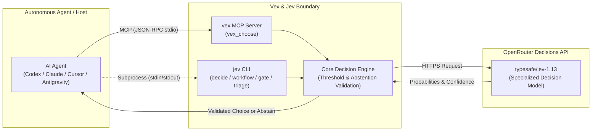

# Vex & Jev

[](https://nodejs.org/)
[](https://www.typescriptlang.org/)
[](https://modelcontextprotocol.io/)
[](https://openrouter.ai/blog/insights/what-is-jev/)
[](https://vitest.dev/)

> **Bounded decision engine, autonomous agent guardrails, standalone CLI, and Model Context Protocol (MCP) server.**

Autonomous AI coding agents frequently struggle with confirmation bias, tool hallucination, and ambiguous branching. **Vex and Jev** provide an independent, external decision boundary. Powered by the [OpenRouter Decisions endpoint](https://openrouter.ai/blog/insights/what-is-jev/) (using `typesafe/jev-1.13`), Jev supplies typed, probability-backed choices, ordinal scores, and probabilistic gates while enforcing strict mathematical abstention thresholds.

---

## Key Highlights

- **External Decision Boundary**: Decouples strategic choices and safety checks from the main agent loop.
- **Strict Bounded Contracts**: Every choice decision evaluates between 2 and 12 distinct options with explicit criteria.
- **Mathematical Abstention Guarantee**: Automatically abstains (`choice: null`, `abstained: true`) if confidence is below `0.70` or the top option's probability lead over the runner-up is below `0.15`.
- **Dual Interface**:
  - **`jev` CLI**: Command-line interface for human operators, shell scripts, and subprocess piping.
  - **`vex` MCP Server**: High-performance, lean stdio Model Context Protocol server exposing `vex_choose`.
- **Multi-Runtime Ready**: First-class workflows for Codex (with Pace agent routing), Claude Desktop, Cursor, and Antigravity.
- **Non-Execution Invariant**: Jev is strictly advisory. It never executes shell commands or alters files; the caller retains execution and verification responsibility.

---

## Architecture Overview



---

## Quickstart

### 1. Requirements & Installation
Requires **Node.js 20** or newer.

```sh
# Clone and build
git clone https://github.com/SideArker/Vex.git
cd Vex
npm ci
npm run build
```

### 2. Configure Environment
Set your OpenRouter API key in your environment or place it in `~/.openrouter_key`:

```sh
export OPENROUTER_API_KEY="sk-or-v1-..."
```

Verify your setup with the doctor command (checks credentials without billable API calls):

```sh
node dist/cli/jev.js doctor
node dist/index.js doctor
```

### 3. Make Your First Bounded Decision

```sh
# Interactive CLI evaluation
node dist/cli/jev.js decide "Which task should take priority?" \
  --option "tests=Fix failing integration tests" \
  --option "feature=Implement user login route" \
  --option "none=Gather reproduction logs first" \
  --context "CI is red on main branch"
```

Output:
```text
Choice: tests (confidence: 0.94)
```

### 4. Inspect Usage & Combined Stats

Check combined activity across both Vex MCP tools and Jev CLI commands, alongside live OpenRouter balances:

```sh
node dist/cli/jev.js stats
node dist/index.js stats
```

Output:
```text
================ VEX & JEV STATS (COMBINED) ================
OpenRouter Account:
  - Key: sk-or-v1-abc...def
  - Key Limit: $5.0000 | Remaining: $4.9978
  - Key Usage: $0.002174
  - Total Credits: $5.0000 | Total Spend: $0.002174

Combined Engine Activity:
  - Total Calls: 32 (Vex: 0, Jev: 32)
  - Total Spend: $0.000989 (avg: $0.000031/call)
  - Tokens: 23,545 prompt in / 3,804 decision out
  - Avg Latency: 527.4ms (total time: 16.88s)

Operations Breakdown:
  - [jev] gate        :  2 calls | $0.000034 | avg 471.8ms
  - [jev] run         : 18 calls | $0.000366 | avg 525.8ms
  - [jev] suggest     :  8 calls | $0.000471 | avg 551.9ms
  - [jev] triage      :  2 calls | $0.000057 | avg 496.1ms
  - [jev] workflow    :  2 calls | $0.000062 | avg 530.4ms
============================================================
```

---

## MCP Server Setup

Vex provides a high-performance, lean stdio MCP server exposing `vex_choose`:
- `vex_choose`: Bounded choice selection with threshold validation ($\ge 0.70$ confidence, $\ge 0.15$ probability lead) across 2 to 12 supplied options. Zero schema bloat and minimal context token footprint.

### Configuration Examples

#### Claude Desktop (`claude_desktop_config.json`)
```json
{
  "mcpServers": {
    "vex": {
      "command": "node",
      "args": ["/path/to/Vex/dist/index.js", "mcp", "serve"],
      "env": {
        "OPENROUTER_API_KEY": "sk-or-v1-..."
      }
    }
  }
}
```

#### Cursor (`.cursor/mcp.json`)
```json
{
  "mcpServers": {
    "vex": {
      "command": "node",
      "args": ["/path/to/Vex/dist/index.js", "mcp", "serve"],
      "env": {
        "OPENROUTER_API_KEY": "sk-or-v1-..."
      }
    }
  }
}
```

#### Codex / Pace
See the detailed [Codex Integration Guide](integrations/codex/README.md) and [Agent Integration Docs](docs/agent-integration.md).

---

## CLI Reference & Cheat Sheet

The package exposes two npm bins: `jev` and `vex`.

```text
Usage: jev <command> [options]

Commands:
  decide [file|-]              Choose from 2-12 supplied options (stdin by default)
  workflow <file>              Evaluate agent workflow context, tools, and review signals
  triage [task]                Classify task type, scope, database touch, and risk
  gate [action]                Assess if a proposed action is destructive or needs escalation
  verify-diff [file|-]         Audit git diff for syntax breaks and unrelated edits
  suggest-skill [task]         Match task against a skill catalog (-c catalog.json)
  route <file> -r <routes>     Route intent with 0.70 confidence threshold
  run [file|-]                 Execute raw typed Decisions JSON request
  doctor                       Check runtime and OpenRouter key availability
```

### Scripting with `jev decide --json`
Piping JSON into `jev decide --json` provides reliable machine-readable output:

```sh
cat << 'EOF' | node dist/cli/jev.js decide --json
{
  "question": "Which action advances this task?",
  "context": "Tests pass; documentation needs review",
  "options": [
    { "id": "review", "description": "Review documentation" },
    { "id": "none", "description": "Gather more evidence" }
  ]
}
EOF
```

Result:
```json
{
  "contractVersion": "1",
  "choice": "review",
  "abstained": false,
  "confidence": 0.92,
  "probabilities": {
    "review": 0.85,
    "none": 0.15
  }
}
```

---

## The Bounded Decision Contract

Jev guarantees that caller options remain sovereign:
1. **Option Guard**: Jev can only select an ID provided by the caller or trigger an internal abstention.
2. **Abstention Criteria**:
   $$\text{Confidence} \ge 0.70 \quad \text{and} \quad P(\text{top}) - P(\text{second}) \ge 0.15$$
   If either condition fails, Jev returns `choice: null` and `abstained: true`.
3. **Structured Abstention**: Callers receive the exact reason for abstention (e.g. `"Insufficient information"`, `"Insufficient confidence or probability lead"`).

---

## Documentation for Agents (`/docs/`)

Explore our dedicated documentation suite built for autonomous agents and contributors:

- [**docs/README.md**](docs/README.md): Documentation roadmap and core agent rules.
- [**docs/architecture.md**](docs/architecture.md): System architecture, type system (`choice`, `score`, `noul`), threshold equations, and engine internals.
- [**docs/agent-integration.md**](docs/agent-integration.md): Agent handbook: abstention handling, safety gates, triage patterns, and Node.js/Python integration snippets.
- [**docs/cli-reference.md**](docs/cli-reference.md): Complete manual of CLI commands, flags, schema specifications, and exit codes.
- [**docs/development.md**](docs/development.md): Development setup, Vitest testing, and contribution policies.

---

## Testing & Quality Assurance

Run the test suite (100% mocked, requires no API key or network):

```sh
npm run check          # Type checking
npm test               # Build and run Vitest test suite
npm pack --dry-run     # Validate release packaging
```

---

## Security & Context Sanitization

- **No Secrets**: Jev sends `context`, `task`, and `state` strings to the OpenRouter Decisions endpoint over TLS. Never include passwords, raw API secrets, or proprietary customer data in prompts.
- **Advisory Only**: Jev results are advisory judgments. Autonomous agents must verify preconditions before acting on choices.

---

## License

ISC License. See package configuration for details.
