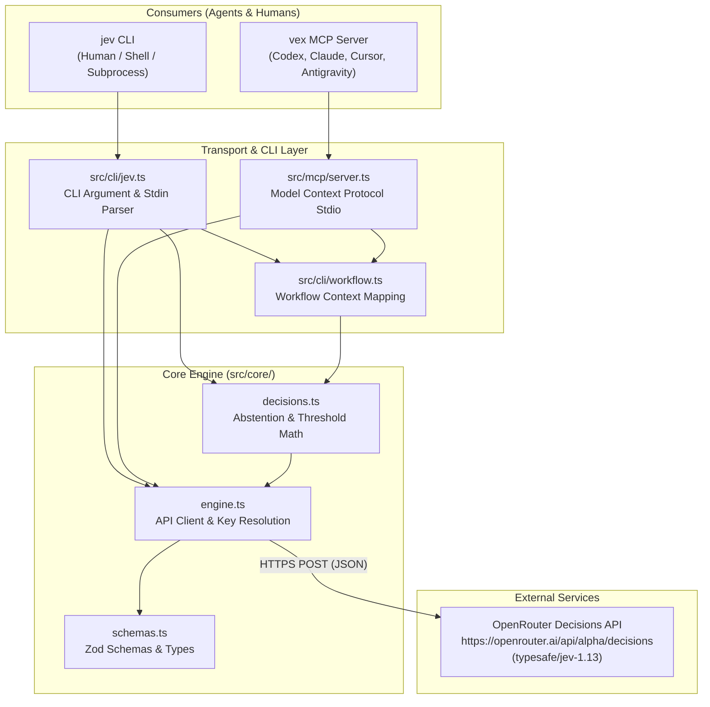
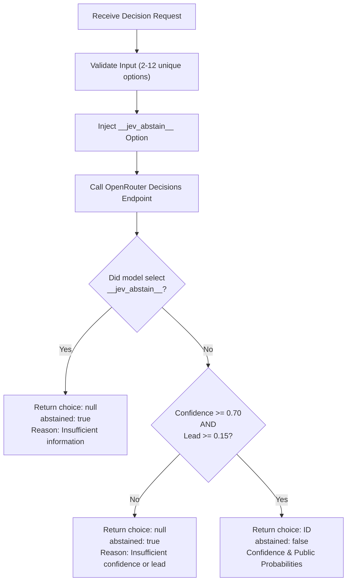

# Vex & Jev System Architecture

This document details the architectural design, core decision engine, mathematical thresholds, type systems, and transport layers of Vex and Jev.

---

## 1. High-Level System Architecture

Vex and Jev provide an **external, bounded decision boundary** for autonomous AI agents and human operators. Rather than allowing an agent to hallucinate arbitrary actions or fall prey to confirmation bias, Vex externalizes decisions to the OpenRouter Decisions endpoint running specialized decision models (default: `typesafe/jev-1.13`).

---

## 2. Core Components

### 2.1 Engine (`src/core/engine.ts`)
The engine layer handles:
- **API Key Resolution**: Checks `OPENROUTER_API_KEY` in environment; falls back to `~/.openrouter_key`. Fails without executing billable calls if key is absent.
- **Strict HTTPS Transport**: Executes typed HTTP POST requests to `https://openrouter.ai/api/alpha/decisions` with abort timeouts (default: 45s).
- **Mockable Execution**: Accepts `EngineOptions` (`apiKey`, `keyProvider`, `fetchImpl`, `timeoutMs`) for zero-network unit testing.
- **Contract Enforcement**: Validates that all questions receive valid, corresponding answers matching input types.

### 2.2 Schemas & Types (`src/core/schemas.ts`)
Jev evaluates three primitive question types:

| Question Type | Definition | Criteria | Output |
|---|---|---|---|
| `choice` | Discrete selection among mutually exclusive options | Record of 2 to 12 `id: description` pairs | `choice: string`, `probabilities: Record<string, number>`, `confidence: number` |
| `score` | Discrete ordinal ranking | Array of at least 2 ordered label strings | `score: number` (index into criteria), `probabilities`, `confidence` |
| `noul` | Continuous probabilistic judgment (0.0 to 1.0) | `criteria: { true: string, false: string }` | `noul: number` (probability of truth) |

### 2.3 Abstention & Threshold Engine (`src/core/decisions.ts`)
A core tenet of Jev is **conservative decision-making**. If evidence is insufficient, or options are too close to call, Jev must **abstain** rather than guess.

#### Bounded Decision Flow (`decide`)
1. Caller provides `question`, optional `context`, optional `constraints`, and 2–12 `options`.
2. Engine injects a synthetic internal option:
   `__jev_abstain__`: *"Insufficient information to justify any supplied option"*.
3. Model evaluates the decision question against all caller options plus the abstain option.
4. Threshold validation:
   - If model chooses `__jev_abstain__` $\rightarrow$ **Abstain** (`choice: null`, `abstained: true`, reason: `"Insufficient information"`).
   - If confidence $< 0.70$ $\rightarrow$ **Abstain** (reason: `"Insufficient confidence or probability lead"`).
   - Probability Lead Check: Let $P(\text{choice})$ be the probability of the top choice, and $P(\text{second})$ be the maximum probability among other options. If:
     $$P(\text{choice}) - P(\text{second}) < 0.15$$
     $\rightarrow$ **Abstain** (lead is below margin of certainty).
5. The internal `__jev_abstain__` option is stripped from public probabilities before returning the result.

---

## 3. Workflow Subsystem (`src/cli/workflow.ts`)

`workflow` maps structured agent operational context to a multi-part Jev decision request:

- **Context Schema**:
  - `runtime`: `"codex"` | `"antigravity"` (model routing is strictly restricted to Codex).
  - `task`: Current task description.
  - `tools`: 2–12 candidate tool descriptions.
  - `agents`: 2–12 candidate specialist agents.
  - `models`: 2–12 candidate model routes (Codex only).
  - `evidence`: Observed facts / terminal output.
  - `acceptance`: Stated acceptance criteria.
  - `proposed_action`: Action planned before execution.

- **Generated Questions**:
  - `tool`: Choice question among candidate tools (if provided).
  - `agent`: Choice question among candidate specialist agents (if provided).
  - `model`: Choice question among candidate models (Codex only, if provided).
  - `enough_information`: `noul` gate checking if evidence is sufficient.
  - `needs_verification`: `noul` gate checking if result requires verification.
  - `task_complete`: `noul` gate checking if acceptance criteria are satisfied.
  - `human_review`: `noul` gate checking if proposed action requires human confirmation.

- **Workflow Summary Logic**:
  - Any choice that does not meet the $0.70$ confidence and $0.15$ lead threshold is omitted from `workflow.selections` and flagged with an uncertain next-step.
  - If `enough_information < 0.70` $\rightarrow$ Next step: `"Gather more information"`.
  - If `needs_verification >= 0.50` $\rightarrow$ Next step: `"Verify result"`.
  - If `task_complete < 0.80` $\rightarrow$ Next step: `"Task completion unproven"`.
  - If `human_review >= 0.40` $\rightarrow$ Flag: `human_review_recommended: true`.

---

## 4. MCP Server Architecture (`src/mcp/server.ts`)

The Vex MCP server runs on standard I/O (`StdioServerTransport`):
- **Isolation**: Standard output (`stdout`) is reserved purely for MCP JSON-RPC protocol framing. Diagnostic messages, server readiness hints, and error logs are routed exclusively to `stderr`.
- **Tools**:
  - `vex_choose`: Exposes the bounded decision contract (`boundedDecisionSchema`).
  - `vex_workflow`: Exposes the multi-dimensional workflow evaluation (`workflowContextSchema`).
- **Non-Execution Invariant**: Vex and Jev are purely advisory. Tools return decisions and structured confidence metadata; they **never** execute shell commands, edit files, or invoke external APIs on behalf of the agent.

---

## 5. Security & Privacy Model

1. **Context Sanitization**: Any string sent in `context`, `evidence`, `task`, or `state` is transmitted over HTTPS to the OpenRouter Decisions API. Agents and users must sanitize API keys, private passwords, and proprietary sensitive code before passing them to Jev.
2. **Read-Only / No Side Effects**: Jev is stateless and read-only. It performs no local filesystem mutations or persistent state tracking.
3. **Exit Code Guarantees**:
   - `0`: Normal completion (decision returned or abstained).
   - `1`: API key missing, upstream HTTP error, network failure.
   - `2`: Invalid argument, bad JSON schema, or malformed command syntax.
